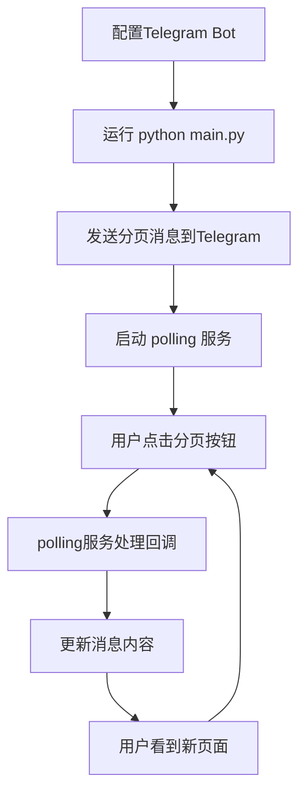

# Telegram分页功能快速上手指南

## 🚀 快速开始

### 1. 配置启用分页功能

在 `config/config.yaml` 中确保以下配置：

```yaml
notification:
  webhooks:
    telegram_bot_token: "YOUR_BOT_TOKEN"
    telegram_chat_id: "YOUR_CHAT_ID"
    
    telegram_pagination:
      enabled: true # 启用分页功能
      use_polling: true # 使用polling模式（推荐）
      polling_interval: 2
      long_polling_timeout: 10
```

### 2. 运行程序

```bash
# 正常运行新闻分析（会自动分页显示）
python main.py

# 如果消息有多页，你会看到类似输出：
# Telegram消息分为 3 页显示 [当日汇总]
# Telegram分页消息发送成功，消息ID: 123 [当日汇总]
# 分页状态已保存: 123456789_123, 3页
```

### 3. 启动Polling服务处理按钮点击

**方式一：独立运行（推荐）**
```bash
# 在新的终端窗口中运行
python telegram_polling_daemon.py
```

**方式二：集成到主程序**
```bash
python main.py --start-polling
```

**方式三：仅运行polling服务**
```bash
python main.py --polling-only
```

### 4. 在Telegram中使用

1. 你会收到一条分页消息，显示 "📄 第 1/3 页"
2. 消息下方有按钮：`◀️ 上一页` `1/3` `下一页 ▶️`
3. 点击按钮即可翻页查看内容
4. 分页状态会保存1小时，期间可以随时翻页

## 💡 使用技巧

### Polling vs Webhook

| 场景 | 推荐方案 |
|------|----------|
| 个人使用 | Polling |
| 本地开发 | Polling |
| 服务器部署 | Polling 或 Webhook |
| 高并发场景 | Webhook |

### 常用命令

```bash
# 查看polling服务帮助
python telegram_polling_daemon.py --help

# 使用代理运行polling
python telegram_polling_daemon.py --proxy http://127.0.0.1:10086

# 指定Bot Token运行
python telegram_polling_daemon.py --token YOUR_BOT_TOKEN
```

### 配置调优

```yaml
# 快速响应配置（消耗更多API调用）
telegram_pagination:
  polling_interval: 1
  long_polling_timeout: 5

# 节省配置（响应稍慢但节省资源）
telegram_pagination:
  polling_interval: 3  
  long_polling_timeout: 20
```

## 🔧 故障排除

### 问题1：按钮点击无响应
**解决方案：**
1. 确保polling服务正在运行
2. 检查Bot Token是否正确
3. 查看polling服务的日志输出

### 问题2：提示"分页会话已过期"
**解决方案：**
1. 重新运行 `python main.py` 获取新的分页消息
2. 或者调整配置中的 `session_ttl_hours` 延长过期时间

### 问题3：网络连接问题
**解决方案：**
```bash
# 使用代理
python telegram_polling_daemon.py --proxy http://your-proxy:port
```

## 📁 文件结构

```
TrendRadar/
├── main.py                           # 主程序（包含分页功能）
├── telegram_polling_daemon.py        # 独立polling守护进程
├── config/config.yaml               # 配置文件
├── output/
│   └── .pagination_states/          # 分页状态存储
└── docs/
    ├── TELEGRAM_PAGINATION.md       # 详细文档
    └── TELEGRAM_POLLING.md          # Polling模式说明
```

## 🎯 完整工作流程



## ✨ 功能特性

- ✅ **无需Webhook**: 使用polling模式，无需设置外部服务器
- ✅ **单条消息**: 所有内容在一条消息内分页，避免刷屏
- ✅ **状态持久化**: 分页状态保存到文件，支持服务重启
- ✅ **自动清理**: 过期状态自动清理，节省存储空间
- ✅ **错误处理**: 完善的异常处理和用户提示
- ✅ **向下兼容**: 可随时关闭分页功能

## 🎉 享受更好的Telegram体验！

现在你可以在Telegram中享受流畅的分页浏览体验了！不再被多条长消息刷屏，一切内容都在指尖轻点之间。
