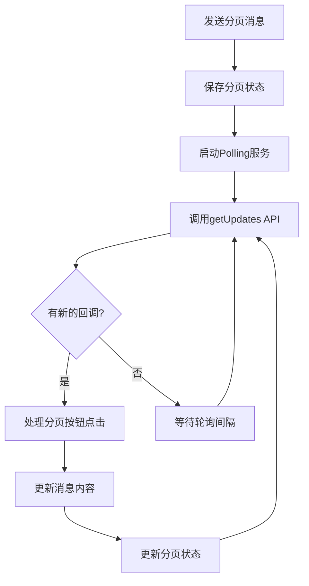

# Telegram Polling 模式使用指南

## 概述

Telegram Polling模式是webhook的替代方案，通过定期轮询Telegram API来获取用户的分页按钮点击事件。这种方式无需设置外部服务器，适合个人部署和本地开发。

## 优势对比

| 特性 | Polling模式 | Webhook模式 |
|------|-------------|-------------|
| 部署复杂度 | ⭐ 简单 | ⭐⭐⭐ 复杂 |
| 服务器要求 | 无需外部服务器 | 需要HTTPS服务器 |
| 防火墙友好 | ✅ 仅出站请求 | ❌ 需要开放端口 |
| 实时性 | ⭐⭐ 1-10秒延迟 | ⭐⭐⭐ 即时响应 |
| 资源消耗 | ⭐⭐ 定期API调用 | ⭐⭐⭐ 低消耗 |
| 调试难度 | ⭐ 容易调试 | ⭐⭐ 较难调试 |

## 配置说明

在 `config/config.yaml` 中配置polling模式：

```yaml
notification:
  telegram_pagination:
    enabled: true # 启用分页功能
    session_ttl_hours: 1 # 分页会话过期时间
    max_pages: 20 # 最大分页数量
    
    # Polling 配置
    use_polling: true # 使用polling模式
    polling_interval: 2 # 轮询间隔（秒）
    long_polling_timeout: 10 # 长轮询超时（秒）
    auto_start_polling: false # 自动启动polling
```

### 配置项详解

- **use_polling**: 选择polling还是webhook模式
- **polling_interval**: 短轮询间隔，仅在长轮询超时为0时生效
- **long_polling_timeout**: 长轮询超时时间，推荐5-30秒，0表示使用短轮询
- **auto_start_polling**: 发送分页消息后自动启动polling（实验性）

## 使用方式

### 方式一：独立polling守护进程（推荐）

使用独立的polling脚本，最稳定可靠：

```bash
# 基本使用（使用配置文件中的设置）
python telegram_polling_daemon.py

# 指定Bot Token
python telegram_polling_daemon.py --token YOUR_BOT_TOKEN

# 使用代理
python telegram_polling_daemon.py --proxy http://127.0.0.1:10086

# 查看帮助
python telegram_polling_daemon.py --help
```

**运行效果：**
```
🚀 Telegram Polling 守护进程启动
📋 配置信息:
   Bot Token: 123456789:...
   代理设置: 无
   轮询间隔: 2秒
   长轮询超时: 10秒
📝 日志:
开始Telegram轮询服务，Bot Token: 123456789:...
```

### 方式二：集成到主程序

在运行主程序时同时启动polling：

```bash
# 运行分析后启动polling服务
python main.py --start-polling

# 仅启动polling服务（不运行新闻分析）
python main.py --polling-only

# 指定Bot Token
python main.py --start-polling --bot-token YOUR_TOKEN
```

### 方式三：程序内自动启动（实验性）

在配置中设置 `auto_start_polling: true`，分页消息发送后自动启动polling线程。

## 工作流程



## 技术细节

### 长轮询 vs 短轮询

**长轮询（推荐）：**
- 设置 `long_polling_timeout: 10`
- API请求会等待10秒或直到有新消息
- 减少API调用次数，提高效率
- 响应更及时

**短轮询：**
- 设置 `long_polling_timeout: 0`
- 每隔 `polling_interval` 秒调用一次API
- API调用频繁，但更可控
- 适合调试和测试

### 错误处理

Polling服务具有完善的错误处理机制：

- **网络错误**: 自动重试，等待5秒后继续
- **API错误**: 记录错误信息，继续运行
- **超时**: 正常现象，继续下次轮询
- **中断信号**: 优雅停止服务

### 性能优化

- **offset管理**: 避免重复处理相同的更新
- **过滤更新**: 只接收callback_query类型的更新
- **合理间隔**: 平衡实时性和API使用量

## 使用场景

### 个人开发者

```bash
# 开发阶段：使用polling daemon方便调试
python telegram_polling_daemon.py --verbose

# 生产部署：使用systemd等管理polling服务
```

### 服务器部署

```bash
# 方案1：单独运行polling服务
nohup python telegram_polling_daemon.py > polling.log 2>&1 &

# 方案2：集成到主程序
python main.py --start-polling
```

### Docker部署

在Dockerfile中添加polling服务：

```dockerfile
# 启动脚本同时运行主程序和polling
CMD ["bash", "-c", "python main.py && python telegram_polling_daemon.py"]
```

## 故障排除

### 常见问题

1. **Bot Token无效**
   ```
   ❌ 获取更新失败: Unauthorized
   ```
   检查Bot Token是否正确配置

2. **网络连接问题**
   ```
   ❌ 获取更新出错: Connection timeout
   ```
   检查网络连接或配置代理

3. **分页状态过期**
   ```
   ⚠️ 分页会话已过期，请重新获取数据
   ```
   用户需要重新运行主程序获取新的分页消息

4. **API频率限制**
   ```
   ❌ 获取更新失败: Too Many Requests
   ```
   增加轮询间隔或使用长轮询

### 调试技巧

1. **启用详细日志**：
   ```bash
   python telegram_polling_daemon.py --verbose
   ```

2. **检查分页状态**：
   查看 `output/.pagination_states/` 目录中的状态文件

3. **测试API连接**：
   ```bash
   curl "https://api.telegram.org/bot<TOKEN>/getMe"
   ```

4. **监控polling状态**：
   ```python
   from main import get_polling_status
   print(get_polling_status())
   ```

## 最佳实践

### 生产环境

1. **使用长轮询**: 设置合理的超时时间（5-30秒）
2. **监控服务**: 使用systemd、supervisor等管理polling进程
3. **日志管理**: 配置日志轮转，避免日志文件过大
4. **错误告警**: 监控polling服务状态，异常时及时告警

### 开发环境

1. **使用短轮询**: 便于调试和测试
2. **详细日志**: 启用verbose模式查看详细信息
3. **快速重启**: 使用独立的polling daemon便于调试

### 配置建议

```yaml
# 生产环境配置
telegram_pagination:
  enabled: true
  use_polling: true
  polling_interval: 3
  long_polling_timeout: 20
  auto_start_polling: false

# 开发环境配置  
telegram_pagination:
  enabled: true
  use_polling: true
  polling_interval: 1
  long_polling_timeout: 5
  auto_start_polling: true
```

## 与Webhook对比

选择polling还是webhook取决于你的部署环境：

**选择Polling的场景：**
- 个人开发和测试
- 无法设置HTTPS服务器
- 防火墙限制严格
- 希望简化部署流程

**选择Webhook的场景：**
- 生产环境，对实时性要求高
- 有稳定的HTTPS服务器
- 希望减少API调用次数
- 需要处理大量并发用户

两种模式可以随时切换，只需修改配置文件中的 `use_polling` 设置即可。
